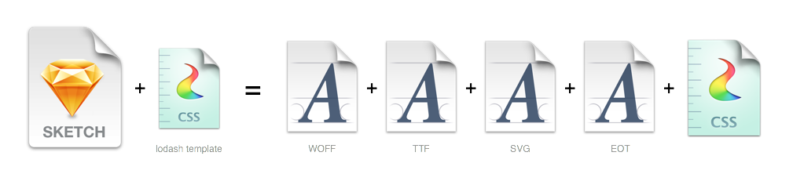
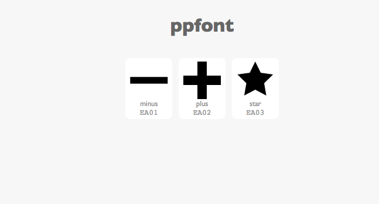

#Mr Porter Font
Sketch to Fonts


#PP Font



## Requirements

- Mac
- [Sketch 3](http://bohemiancoding.com/sketch) and [Sketch Tools](http://bohemiancoding.com/sketch/tool/)
- [Node.js](http://nodejs.org/)
- [gulp.js](http://gulpjs.com/)


## Setup Tools

### Sketch and Sketch Tools

You haven't got Sketch yet? Visit [App Store](https://itunes.apple.com/jp/app/sketch-3/id852320343?l=en&mt=12). It's worth more than its price tag. Next, get the `sketchtool` to controll Sketch.app via CLI.

0. Download [Sketch Tools](http://sketchtool.bohemiancoding.com/sketchtool-latest.zip).
0. Unzip the archive.
0. Open Terminal.
0. Change the current directory to the unziped folder.
0. Run the instll script and enter your password.

```bash
$ cd ~/Donwloads/scketchtool/
$ sudo ./install.sh
```

### Node.js and gulp.js

You need some command line environments. But don't worry. Almost all will be done through GUI.

Go to [http://nodejs.org/](http://nodejs.org/) and click the INSTALL link.

Open Terminal.app. You may find it at `/Applications/Utilities/Terminal.app` as you know. Type the command below to install gulp.

```bash
$ sudo npm install -g gulp
```
### Install

```bash
$ npm install
```

We use these plugin for gulp.js, FYI.

- [gulp-sketch](https://github.com/cognitom/gulp-sketch)
- [gulp-iconfont](https://github.com/nfroidure/gulp-iconfont)


## Draw Icons

- mrporter.sketch (default)

### Name convention

The name of the artboard is important. It define the name of not only the glyph but also the class of CSS.

- `icon_name`: The character code will be assign automatically
- `uF701-icon_name`: You can assign the code manually


## Gulp!

After saving your Sketch file, go back to Terminal.app again.

```bash
$ gulp symbols
```

Then check the `dist` directory. There'll be the font and CSS files generated.


### Config

Edit `gulpfile.js`

## CSS Styles

You can choose CSS Style templates (mrporter-style), and make your own with [lodash template](http://lodash.com/docs#template).
